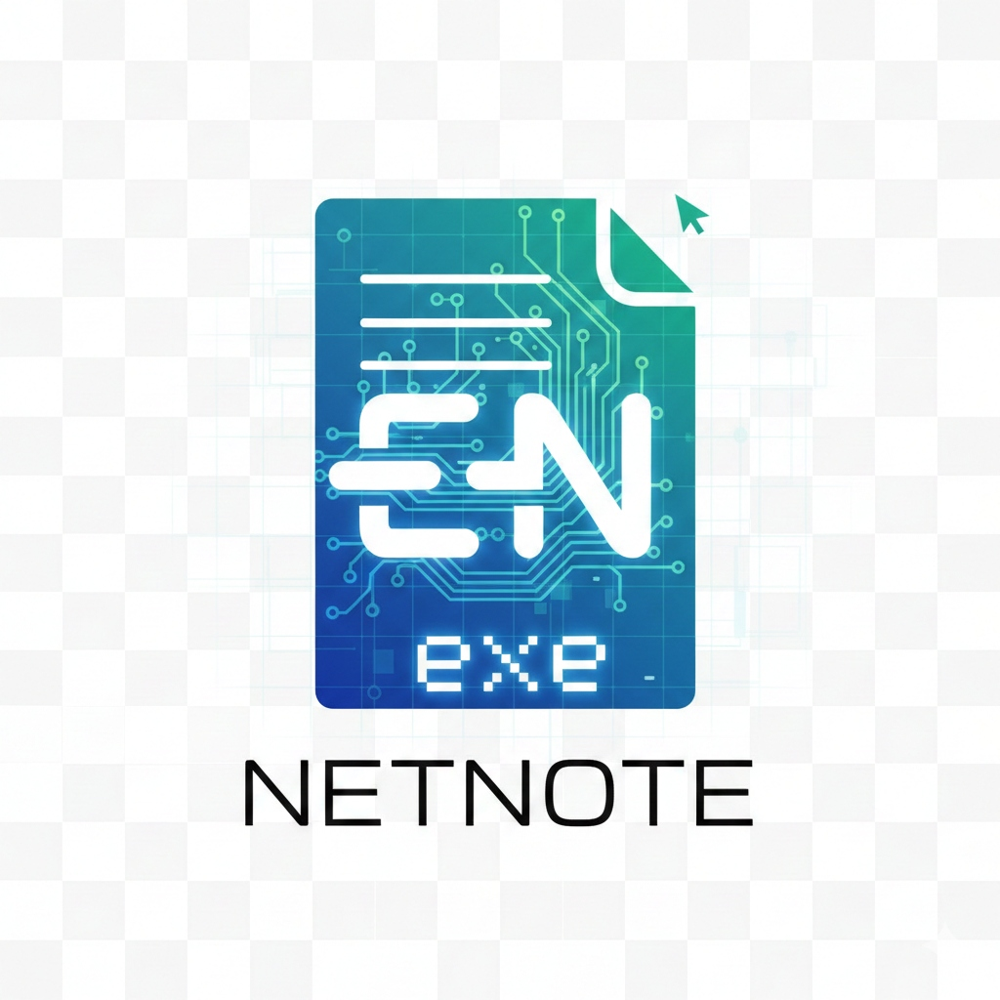

<div align="center">
  
  
  # NetNote
  
  **Il Tuo Pensiero. Privato & Locale.**

  ### [🌐 Visita il Sito Ufficiale: netnote.netlify.app](https://netnote.netlify.app/)
  
  [](https://netnote.netlify.app/)
  [](https://github.com/inferis995/netnote/releases/latest)
  [](https://github.com/inferis995/netnote)
  [](LICENSE)

  <p align="center">
    <a href="#caratteristiche">Caratteristiche</a> •
    <a href="#installazione">Installazione</a> •
    <a href="#sviluppo">Sviluppo</a> •
    <a href="#sicurezza">Privacy</a>
  </p>
</div>

---

## 🚀 Che cos'è NetNote?

**NetNote** è un'applicazione desktop di nuova generazione per la presa di appunti, progettata con un unico dogma: **Privacy Assoluta**.

A differenza di Notion o Evernote, NetNote **non invia mai** i tuoi dati al cloud. Integra potenti modelli di Intelligenza Artificiale (Whisper per la trascrizione vocale e Llama 3 per i riassunti) che girano **interamente sul tuo computer** grazie all'integrazione nativa con [Ollama](https://ollama.com).

### ✨ Caratteristiche Principali

*   **🔒 100% Offline & Privato:** I tuoi pensieri restano sul tuo disco rigido. Nessun server, nessun tracciamento.
*   **🎙️ Trascrizione Vocale (Whisper):** Registra riunioni o note vocali e ottieni trascrizioni perfette in tempo reale.
*   **🧠 Riassunti & Chat IA (Llama 3):** Chiedi al tuo "Secondo Cervello" di riassumere note, estrarre task o brainstorming.
*   **📝 Editor Markdown Wysiwyg:** Scrivi con la formattazione che ami, senza distrazioni.
*   **⚡ Costruito con Tauri:** Leggerissimo, veloce e sicuro (scritto in Rust + React).

---

## 📥 Installazione

### Requisiti
1.  **Windows 10/11** (x64)
2.  **Ollama** installato e in esecuzione (per le funzionalità IA).

### Setup Rapido
1.  Scarica l'ultima release dalla [pagina Releases](https://github.com/inferis995/netnote/releases/latest).
2.  Installa il file `.exe`.
3.  Assicurati di avere Ollama avviato (`ollama run llama3` nel terminale).
4.  Avvia NetNote e inizia a creare.

---

## 🛠️ Sviluppo

Vuoi contribuire o compilare il codice sorgente?

```bash
# Clona il repository
git clone https://github.com/inferis995/netnote.git

# Entra nella cartella
cd netnote

# Installa le dipendenze
npm install

# Avvia in modalità sviluppo
npm run tauri dev
```

### Stack Tecnologico
*   **Frontend:** React, TypeScript, Tailwind CSS v4, Framer Motion.
*   **Core:** Rust (Tauri v2).
*   **AI Engine:** Ollama (External), Whisper (Native Rust bindings).
*   **Database:** SQLite (Locale).

---

## 🔐 Sicurezza & Privacy

NetNote è costruito secondo il principio del **Local-First**.
*   Il database è un file SQLite locale criptato.
*   Le chiavi API (se usate opzionalmente) sono salvate nel KeyChain del sistema operativo.
*   Nessuna telemetria viene inviata agli sviluppatori.

---

<div align="center">
  <sub>Costruito con ❤️ per la Privacy.</sub>
</div>
